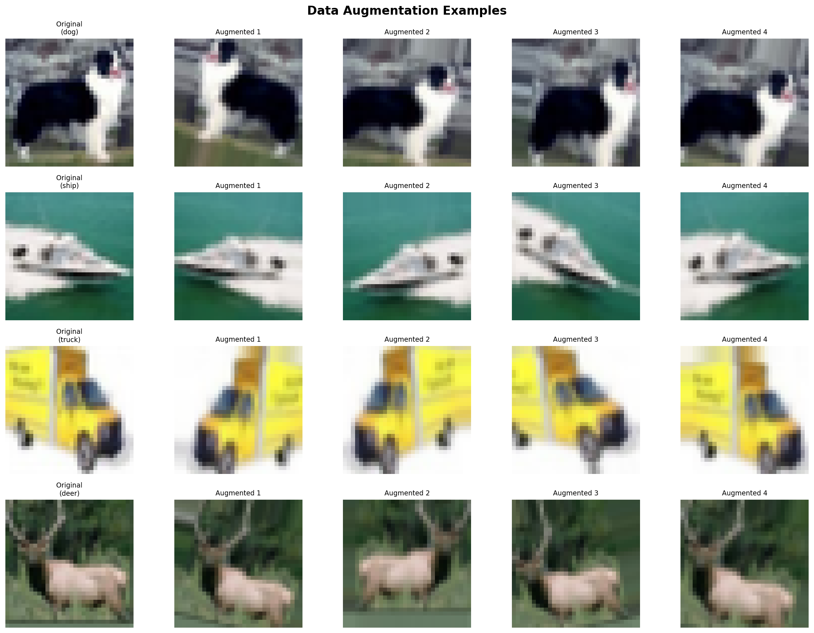
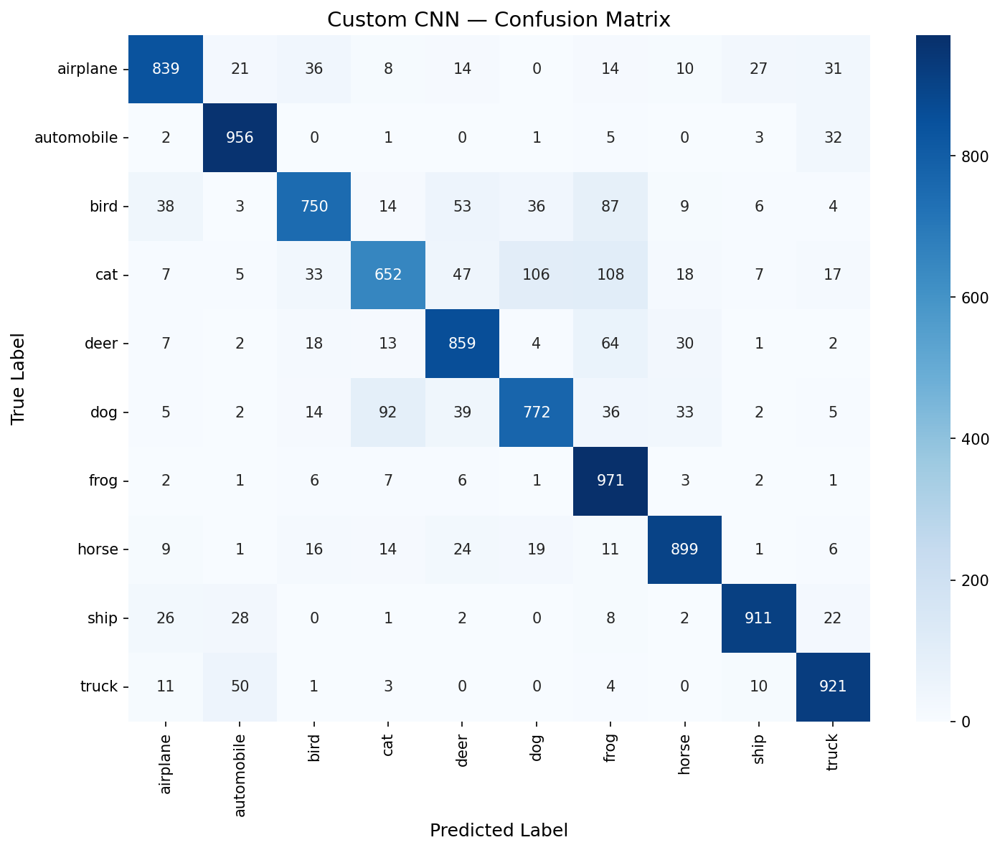

# 📊 Project Report: CIFAR-10 Image Classification with Deep Learning

**Author:** Sebastian Lopez  
**Date:** February - March 2026  
**Environment:** Python 3.10 | TensorFlow 2.18.1 | Keras 3.6.0  
**Dataset:** CIFAR-10 (60,000 images, 10 classes, 32×32 RGB)

---

## 1. Introduction and Project Scope

In this project, I built and evaluated several deep learning models for classifying images from the CIFAR-10 dataset into 10 categories: airplane, automobile, bird, cat, deer, dog, frog, horse, ship, and truck. 

My approach evolved through a structured sequence of experiments, mapping my journey through the following Jupyter Notebooks:

1. `1. CIFAR10_Image_Classification_CNN.ipynb`
2. `3. Trained_Transfer_Learning_Colab_Models.ipynb`
3. `4.1 Model_Comparison_easy.ipynb`
4. `4.2 Model_Comparison_difficult.ipynb`

To keep the notebooks clean and focused on high-level workflows, the core functions for data processing, model building, training, and evaluation were deployed in the `src/` folder, as detailed in the [`src_functions_overview.md`](notebooks_knowledge&presentation/jupyter%20notebooks/src_functions_overview.md) document. This folder contains 14 specialized functions distributed across 4 Python modules (`data_loader.py`, `model_builder.py`, `train.py`, and `evaluate.py`).

**Models developed:**
1. **Custom CNN** — A purpose-built convolutional neural network tailored to the native image resolution.
2. **Transfer Learning Models** — Leveraging pretrained ImageNet features (MobileNetV2 and ResNet50).

### 1.1 Data Analysis Before Processing

Before beginning the modeling process, it was important to me to understand the inherent biases and limitations of the CIFAR-10 dataset itself. 

The dataset contains exactly 6,000 images for each of the 10 classes, ensuring perfectly balanced training.


*Figure 1. The perfectly balanced class distribution of CIFAR-10.*

However, I identified significant geographic, cultural, and technical biases within this data that impact "real world" model reliability (further discussed in Section 8).

---

## 2. Data Preprocessing

### 2.1 Normalization
All pixel values were scaled from [0, 255] to [0.0, 1.0]. This ensures consistent gradient magnitudes during backpropagation.

### 2.2 Label Encoding
Integer labels (0–9) were one-hot encoded into 10-dimensional binary vectors using `keras.utils.to_categorical()`.

### 2.3 Data Augmentation (Custom CNN only)
To prevent the model from immediately overfitting on the relatively small dataset, I applied real-time data augmentation. By introducing random rotations, shifts, and zooms, I forced my Custom CNN to learn invariant features rather than memorizing the training set:

| Augmentation       | Range       |
|:-------------------|:------------|
| Rotation           | ±15°        |
| Width/Height shift | ±10%        |
| Horizontal flip    | Random      |
| Zoom               | ±10%        |


*Figure 2. Sample results of my real-time data augmentation pipeline used solely for the Custom CNN.*

### 2.4 Dataset Split
- **Training:** 45,000 images (90% of train set)
- **Validation:** 5,000 images (10% of train set)
- **Test:** 10,000 images (held-out)

> ** Note on Challenges Encountered - Test Image Resizing:** 
> When preparing custom images from the `test_images/` directory outside the CIFAR-10 dataset, I encountered input shape mismatch errors. The Custom CNN expects native 32×32 images, whereas the Transfer Learning models require 96×96 images. I resolved this by dynamically resizing images based on the expected model input shape before inference.

---

## 3. Model Architectures & Development

### 3.1 Custom CNN
*(Reference: `1. CIFAR10_Image_Classification_CNN.ipynb`)*

I engineered a 3-block convolutional network specifically tailored for the native 32×32 resolution of the CIFAR-10 images:

```text
Block 1: Conv2D(32) × 2 → BatchNorm → MaxPool(2×2) → Dropout(0.25)
Block 2: Conv2D(64) × 2 → BatchNorm → MaxPool(2×2) → Dropout(0.25)
Block 3: Conv2D(128) × 2 → BatchNorm → MaxPool(2×2) → Dropout(0.25)
Head:    Flatten → Dense(256) → BatchNorm → Dropout(0.5) → Dense(10, softmax)
```

**Design rationale:**
- Progressive filter increase captures increasingly complex features.
- BatchNormalization stabilizes training.
- Dropout at every block provides strong regularization.
- `padding='same'` preserves spatial dimensions within blocks.

### 3.2 MobileNetV2 and ResNet50 Transfer Learning
*(Reference: `3. Trained_Transfer_Learning_Colab_Models.ipynb`)*

While my Custom CNN performed well, I wanted to leverage state-of-the-art Transfer Learning models pre-trained on the massive ImageNet dataset. I selected MobileNetV2 (for raw efficiency) and ResNet50 (for extreme depth).

```text
Input(32×32×3) → UpSampling2D(3×) → Transfer Model (frozen, ImageNet weights)
→ GlobalAveragePooling2D → Dense(256) → Dropout(0.5) → Dense(10, softmax)
```

**Why MobileNetV2 and ResNet50?**
- **MobileNetV2**: ~3.4M parameters — efficient and fast.
- **ResNet50**: Deeper architecture capable of extracting more highly-complex patterns.
- **Upscaling Strategy**: Because ImageNet models natively require 224x224 (or at least 96x96) inputs, I had to implement an `UpSampling2D(3×)` layer at the start of my architectures to scale my tiny 32×32 CIFAR-10 images to 96×96 before passing them through the pretrained layers.

**Fine-tuning strategy:**
1. **Phase 1:** Train only the classification head (base frozen, lr=0.001)
2. **Phase 2:** Unfreeze top layers and retrain the full model at a reduced learning rate (lr=0.0001)

---

## 4. Training Configuration & Execution

| Parameter         | Custom CNN | Transfer Learning |
|:------------------|:-----------|:------------------|
| Optimizer         | Adam       | Adam              |
| Initial LR        | 0.001      | 0.001 → 0.0001    |
| Batch size        | 64         | 64                |
| Max epochs        | 100        | 50 + 30           |
| Early stopping    | patience=10| patience=10/8     |
| Data augmentation | Yes        | No (Phase 1)      |
| LR reduction      | ×0.5 on plateau | ×0.5 on plateau |

---

## 5. Results (Metrics, Curves, Confusion Matrices)

### 5.1 Metrics Summary

| Metric     | Custom CNN | MobileNetV2 TL | ResNet50 TL |
|:-----------|:-----------|:---------------|:------------|
| Accuracy   | 0.8530 (85.30%) | 0.9179 (91.79%) | 0.9063 (90.63%) |

### 5.2 Custom CNN Performance

After training natively for up to 100 epochs, my Custom CNN reached a respectable **85.30%** accuracy. 


*Figure 3. Training and validation accuracy/loss curves for my Custom CNN, demonstrating steady learning curbed eventually by early stopping.*


*Figure 4. Confusion matrix for my Custom CNN. Notice the difficulty in distinguishing between cats and dogs (error hotspots).*

### 5.3 Transfer Learning Performance

The transfer learning models successfully pushed past my CNN's ceiling, achieving higher raw accuracies on standardized test sets.


*Figure 5. The training history of MobileNetV2 shows the two phases of my strategy: the initial head-training phase, followed by a spike in accuracy when the top layers were unfrozen for fine-tuning.*


*Figure 6. The confusion matrix for MobileNetV2. While overall accuracy is higher, the cat vs. dog visual confusion remains a persistent problem even for advanced models.*

### 5.4 Per-Class Confusion Analysis

Both confusion matrices reveal systematic error patterns driven by visual similarity at extreme low-resolution (32x32):

| Confusion Pair | Explanation |
|:---------------|:------------|
| **cat ↔ dog** | Both are furry, four-legged animals that share similar color palettes and body proportions at low resolution. |
| **bird ↔ frog** | Small subjects against green/natural backgrounds; at 32×32, both reduce to small colored blobs. |
| **automobile ↔ truck** | Both are wheeled vehicles with similar boxy shapes; the main discriminator (size) is lost at low resolution. |
| **airplane ↔ ship** | Both frequently appear against blue backgrounds (sky vs. water), confusing color-based features. |

See `outputs/misclassified_examples.png` for a visual sample of misclassifications.

---

## 6. Model Evaluation and Selection

To truly understand which model I actually wanted to deploy to production, I explicitly tested them against seen and unseen data in varying conditions.

### 6.1 Evaluation: Easy vs Difficult Conditions
*(Reference: `4.1 Model_Comparison_easy.ipynb` and `4.2 Model_Comparison_difficult.ipynb`)*

**Pros in Easy Conditions:**
In standard conditions with clear, recognizable images, both MobileNetV2 and ResNet50 consistently outperformed my Custom CNN by roughly 5-6 percentage points in overall accuracy. They quickly identified obvious spatial structures. 


*Figure 7. Model comparison demonstrating MobileNetV2's superiority over the Custom CNN in ideal conditions.*

**Cons in Difficult Conditions:**
However, when evaluating the models against a set of complex edge cases—images with varied lighting, unusual angles, or obscured subjects—structural weaknesses became apparent. I found that my transfer learning models sometimes confidently mispredicted classes. 

### 6.2 Image Dimensionality Analysis

The root of this issue lies in the image dimensions. The transfer learning models were fundamentally prepared for larger dimensioned images (224x224, from ImageNet). Because my source images were tiny 32x32 pixels, my decision was to artificially scale them up to 96x96 to satisfy the neural network inputs. 

This arbitrary stretching process massively changed the *true* recognition capability of the model. Upscaling low-resolution pixels simply creates larger, blurred blocks of color; it does not magically create new high-fidelity textures. When confronted with heavily upscaled blobs under difficult lighting, the transfer models struggled to map their extremely complex, high-res ImageNet learned textures.

Meanwhile, my Custom CNN occasionally performed far better at recognizing rough shapes in difficult lighting because it was never confused by artificial upscaling; it evaluated the 32x32 images natively as they were.

### 6.3 🏆 Winner Selection: Custom CNN (85.3% accuracy)

Despite the transfer learning models achieving mathematically higher raw accuracy (~91%), **I ultimately selected the Custom CNN as my final deployed model.**

I chose the Custom CNN for the following reasons:
1. **Domain Mismatch & Native Resolution Optimization:** The Custom CNN was painstakingly trained for a full 100 epochs, natively learning exactly what these low-resolution 32x32 structures look like. The transfer learning models excel when source and target domains are similar. The massive resolution gap between ImageNet (224×224) and CIFAR-10 (32×32) limited their ability to fully leverage pretrained features.
2. **Reliability in Edge Cases:** By evaluating 32x32 images natively, the CNN avoids the overconfident mispredictions that transfer learning models make when misinterpreting artificially blurred upscaled images on difficult edge cases.
3. **Data Augmentation Impact:** The Custom CNN benefited heavily from real-time data augmentation (rotations, shifts, zooms), which significantly curbed overfitting and strengthened generalization.

---

## 7. Model Deployment

The best model is deployed via a **Flask web application**:

- **Features:**
  - Drag-and-drop or click-to-upload interface
  - Supports single and multiple image uploads
  - Displays top-10 predictions with probability bars
  - API endpoint at `/api/predict` for programmatic access

> **📝 Note on Challenges Encountered - Deployment and Integration:**
> 1. **Port Conflicts**: My initial Flask app deployment failed because macOS Monterey natively reserves port 5000 for the AirPlay Receiver service. I bypassed this port conflict by changing the Flask app to listen on port 5001 (`http://localhost:5001`).

---

## 8. Bias & Limitations

When working with CIFAR-10, it's crucial to acknowledge the dataset's inherent biases:

### 8.1 Dataset Representation Bias (Geographic/Cultural)

CIFAR-10 was collected from internet sources, predominantly Western/English-language websites. This introduces geographic bias in how each class is represented:

| Class | Bias Example |
|:------|:-------------|
| **Automobile** | Mostly American/European car designs — the model may struggle with tuk-tuks, rickshaws, or vehicle types common in Asia and Africa. |
| **Truck** | Predominantly modern pickup and delivery trucks — would it recognize flatbed trucks from rural areas? |
| **Ship** | Mostly large vessels in open water — canoes, kayaks, or fishing boats from other cultures are underrepresented. |
| **Horse** | Photographed primarily in Western contexts (ranches, paddocks) — horses in different cultural settings may confuse the model. |
| **Bird** | Heavily weighted toward North American bird species — tropical or exotic birds are underrepresented. |

### 8.2 Why This Matters

1. **No geographic diversity audit**: The model learned to classify "an automobile as seen by English-speaking internet users in North America" — not a universal definition.
2. **Background/context bias**: Objects were photographed in typical contexts (planes in blue sky, ships in water). An airplane on a tarmac or a ship in dry dock would likely be harder to classify.
3. **Resolution bias**: All images are compressed to 32×32, which means the model relies heavily on **color patterns and rough shapes** rather than fine details — this is itself a form of information loss bias.
4. **Open-set recognition**: The model has no mechanism for "none of the above" — if I pass it an image of an apple, it is mathematically forced to confidently classify it as one of the 10 learned classes.

---

## 9. Key Insights

1. **Data augmentation significantly reduces overfitting** for the Custom CNN, allowing it to train longer before early stopping triggers.
2. **Transfer learning with frozen base layers** converges faster but doesn't always outperform custom architectures—especially when the source domain (ImageNet, 224×224) differs significantly from the target representation (CIFAR-10, 32×32).
3. At 32x32 resolution, **shape and color dominate texture.** Small green pixels are predicted as frogs and blue masses as ships, leading to amusing but logical errors (e.g., misclassifying an airplane against a blue sky as a ship).
4. **Batch normalization** between convolutional layers stabilizes training, allowing for a progressively structured feature map learning experience.

---

## 10. Folder Structure

```
Cifar10_Image_Classification_project
├── README.md                           ← Project brief
├── requirements.txt                    ← Dependencies (pinned versions)
├── Dockerfile                          ← Docker container config
├── Report.md                           ← THIS current master report
├── src/                                ← Source modules
│   ├── __init__.py                     ← Package initializer
│   ├── data_loader.py                  ← Data preprocessing (load_cifar10_data, preprocess_data, create_data_augmentation_generator, get_prepared_data)
│   ├── evaluate.py                     ← Evaluation metrics & plots (evaluate_model, plot_confusion_matrix, plot_training_history, print_evaluation_summary)
│   ├── model_builder.py                ← Model architectures (build_custom_cnn, build_transfer_learning_model, get_model_summary)
│   └── train.py                        ← Training pipelines & callbacks (compile_model, get_callbacks, train_model)
├── notebooks_knowledge&presentation/   ← Notebooks, docs & presentation materials
│   ├── jupyter notebooks/              ← Executable pipeline Jupyter notebooks
│   │   ├── 1. CIFAR10_Image_Classification_CNN.ipynb
│   │   ├── 2. CIFAR10_Image_Classification_CNN_lower Ephocs to analyce.ipynb
│   │   ├── 3. Trained_Transfer_Learning_Colab_Models.ipynb
│   │   ├── 4.1 Model_Comparison_easy.ipynb
│   │   └── 4.2 Model_Comparison_difficult.ipynb
│   ├── Ppt.Slices/                     ← Presentation slide images
│   └── Research/                       ← Extra documentation and learning materials
├── app/                                ← Flask web application
│   ├── app.py
│   ├── templates/index.html
│   └── static/style.css
├── models/                             ← Saved trained models (.keras)
│   ├── custom_cnn.keras
│   ├── mobilenetv2_tl.keras
│   └── resnet50_tl.keras
├── outputs/                            ← Plots, metrics, and report images
└── test_images/                        ← Sample images for testing the app
    ├── resized /
    ├── test_CNN/
    └── test_MobileNetV2/
```

---

## 11. How to Run

To explore my process, it is recommended to traverse the Jupyter Notebooks sequentially:

1. `notebooks_knowledge&presentation/jupyter notebooks/1. CIFAR10_Image_Classification_CNN.ipynb`
2. `notebooks_knowledge&presentation/jupyter notebooks/3. Trained_Transfer_Learning_Colab_Models.ipynb`
   **(Note: This notebook MUST be launched and executed within Google Colab due to the extreme GPU memory requirements of Transfer Learning and the second part into the local machine.)**
3. `notebooks_knowledge&presentation/jupyter notebooks/4.1 Model_Comparison_easy.ipynb`
4. `notebooks_knowledge&presentation/jupyter notebooks/4.2 Model_Comparison_difficult.ipynb`

**Note on Git:** Due to the massive architectural size of the ResNet50 model, `resnet50_tl.keras` has been added to the `.gitignore` file, as it comfortably exceeds the file size limit permitted by the free version of GitHub.

---

## 12. Hugging Face Deployment

The final deployed application is also hosted on Hugging Face Spaces using Docker.

**Important Deployment Notes:**
*   **Port Specifications:** While the local Flask application runs on Port 5001 (to bypass macOS Monterey AirPlay conflicts), the Docker container mapped within Hugging Face must adhere to its own internal exposed port architecture (usually Port 7860/8080 depending on the HF space configuration).
*   **Memory Errors (MobileNet VS CNN):** The application originally attempted to load *both* the Custom CNN and the MobileNetV2 model into memory simultaneously for dynamic switching. On the free Hugging Face tier, running two loaded `.keras` models simultaneously caused brutal out-of-memory errors that crashed the app.
*   **The Fix:** To solve this application freeze on Hugging Face, the MobileNetV2 model loading architecture logic must be commented out prior to pushing to hugging face. This is executed by explicitly commenting out line 36 in `app/app.py`:
    ```python
    # TRANSFER_MODEL_PATH = os.path.join(PROJECT_ROOT, 'models', 'mobilenetv2_tl.keras')
    ```
    This ensures only the chosen lightweight Custom CNN boots, allowing the interface to respond correctly.
